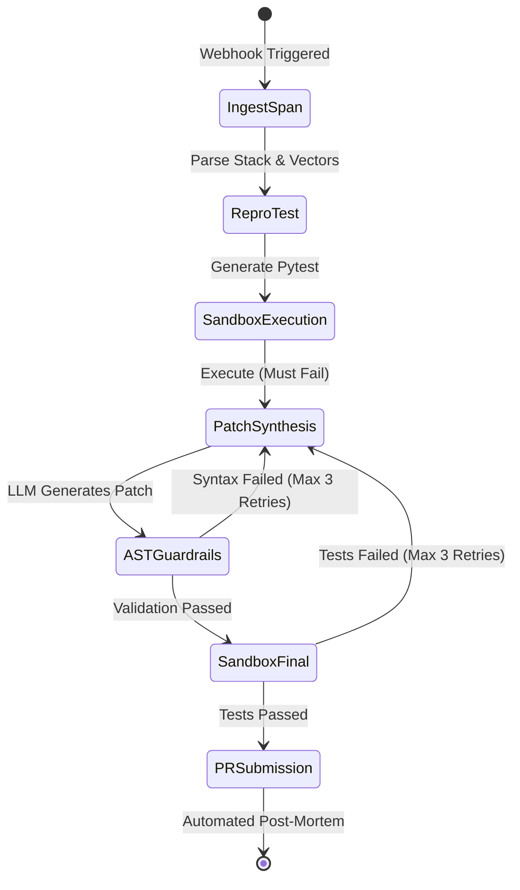

# GhostMachine & CMS Ecosystem: System Architecture & Context

This document provides a comprehensive architectural overview and context for the **GhostMachine** ecosystem, which comprises an autonomous Site Reliability Engineering (SRE) control plane (`ghostmachine-core`) and its reference target application (`tim-ohagan-cms`).

> For operational workflows, runbooks, and secrets management, see the [Project Knowledge Base](knowledge_base.md).

## 1. Executive Summary

The system is a dual-repository architecture designed to demonstrate autonomous fault detection, isolation, and remediation. 

1. **`tim-ohagan-cms`**: A FastAPI-based portfolio and Content Management System. It serves production traffic but includes a "Chaos Playground" to intentionally trigger faults.
2. **`ghostmachine-core`**: An autonomous SRE Control Plane. It receives error telemetry from the CMS, synthesizes reproduction tests, drafts code patches using Large Language Models (Google Gemini), verifies the patches in an ephemeral sandbox, and submits GitHub Pull Requests to fix the issues.

---

## 2. High-Level Architecture

The following diagram illustrates the interaction between external clients, the ingress proxy, the target CMS, and the SRE control plane.

```mermaid
flowchart TD
    Client((Client)) -->|HTTPS| Caddy[Caddy Reverse Proxy]
    
    subgraph "Target Application (tim-ohagan-cms)"
        Caddy -->|"/"| CMS_App[FastAPI App]
        CMS_App --> Postgres[(PostgreSQL)]
        CMS_App --> Redis[(Redis)]
        CMS_App -->|"Uncaught Exception"| Middleware[GhostMachineMiddleware]
    end

    subgraph "SRE Control Plane (ghostmachine-core)"
        Middleware -.->|"POST /api/webhooks"| WebhookIngest[Ingestion API]
        WebhookIngest --> LangGraph[LangGraph Orchestrator]
        LangGraph --> DockerSandbox[Ephemeral Docker Sandbox (gVisor)]
        LangGraph <--> Gemini[Google Gemini LLM]
    end

    LangGraph -->|"Create PR"| GitHub[GitHub Repository]
    GitHub -.->|"CI/CD"| CMS_App
```

---

## 3. Component Details

### 3.1. Target Application: `tim-ohagan-cms`

The target application is a modern, async Python web service serving as both a portfolio and a demonstrator for the control plane.

*   **Tech Stack**: FastAPI (Python 3.11+), PostgreSQL 15 (via `asyncpg` / SQLAlchemy 2.0, Alembic migrations `106fe860d751`, `206fe860d752`, & `306fe860d753`), Redis 7.
*   **Database Schema**: Relational persistence across `profiles`, `posts` (with indexed `category` domain column), `comments`, and `contact_messages`.
*   **Frontend**: Vanilla HTML5, CSS3 with a Cyberpunk Glassmorphic dark design system (`styles.css?v=2.3`, `app.js?v=2.0`), ambient glowing orbs, and deep-linking SPA hash routing.
*   **Key Modules**:
    *   **Categorized Technical Transmissions (`/#posts`, `/#posts/{category-slug}`)**:
        *   Taxonomy: `Autonomous SRE`, `Chaos Engineering`, `Agentic Architecture`, and `AI Security & Guardrails`.
        *   Dynamic Category Navigation Bar & live transmission counter pills.
        *   Explore by Domain overview shelf cards on `/#posts`.
        *   Dedicated Category Page views (`/#posts/{slug}`) with breadcrumb hierarchy, hero banners, and domain descriptions.
        *   Endpoints: `GET /posts/categories` (aggregated categories, slugs, icons, descriptions, and post counts) and `GET /posts/?category={slug}`.
    *   **Chaos Playground (`/#playground`)**: Exposes intentional failure vectors to trigger the remediation pipeline:
        *   `/playground/fault/cpu-500`: CPU fault (divide-by-zero).
        *   `/playground/fault/schema-422`: Schema payload violation.
        *   `/playground/fault/db-deadlock`: PostgreSQL concurrent row lock contention.
        *   `/playground/fault/memory-asset`: Memory allocation exhaustion.
    *   **Autonomous Telemetry Middleware (`GhostMachineMiddleware`)**: Intercepts `5xx` errors and application crashes. It captures stack frames, request vectors, and OpenTelemetry trace IDs (`x-b3-traceid`). 
    *   **Admin Dashboard & Contact Inbox**: Public contact submission (`POST /api/contact/`) with protected inbox (`GET /api/contact/`, `/admin`) gated behind HTTP Basic Authentication.

### 3.2. SRE Control Plane: `ghostmachine-core`

The control plane orchestrates the autonomous remediation lifecycle.

*   **Tech Stack**: FastAPI, LangGraph, Google Gemini (`gemini-3.8-flash`), Docker + gVisor (`runsc`), PostgreSQL (for State Checkpointing via `PostgresSaver`).
*   **Key Modules**:
    *   **Control Plane API**: Provides webhook ingestion endpoints (`POST /api/webhooks`) and dual health checks (`GET /health` direct, and `GET /api/health` reverse-proxied via Caddy). Incorporates a **Redis Trace Hashing Deduplication Layer** to prevent container exhaustion during cascading outages by enforcing a 15-minute TTL on identical stack signatures.
    *   **LangGraph Orchestrator**: A typed state machine coordinating the pipeline across ingestion, reproduction, patching, and staging. The shared `IncidentState` TypedDict declares 18 fields covering trace context (`trace_id`, `incident_id`), pipeline outputs (`repro_test_path`, `proposed_patch`, `sandbox_exit_code`), guardrail validation (`guardrail_status`, `guardrail_reason`), PR results (`pr_url`, `pr_error`), telemetry (`total_tokens`, `compute_seconds`), and post-mortem metadata.
    *   **COS Uplink AI**: An interactive chatbot simulating a Central Operating System persona, accessible via the web UI.

---

## 4. Remediation Workflow (LangGraph State Machine)

When a fault occurs in the CMS, the following pipeline executes in under 90 seconds. The entire state is durably persisted at every node transition using a **PostgresSaver checkpointer**. This guarantees fault-tolerance across container restarts and allows for time-travel debugging of failed remediations.



1.  **Ingest Span**: Parses incoming webhooks for stack frames and trace context. Implements Redis-based trace hashing (SHA-256 of exception class + top 5 stack frames) to deduplicate concurrent identical alerts and protect the orchestration pipeline from exhaustion.
2.  **Repro Test Synthesis**: Generates a standalone `pytest` test case using `httpx` that reliably reproduces the exact crash condition.
3.  **Sandbox Execution**: Runs the repro test in an isolated Docker container powered by the **gVisor (`runsc`)** user-space kernel for defense-in-depth isolation. Patches are applied leniently via `patch -p1` with `git config --global --add safe.directory` to handle Docker volume ownership. Validates that the test *fails* (`exit_code != 0`).
4.  **Patch Synthesis & AST Guardrails**: 
    *   Implements **Lightweight Context Enrichment** by parsing stack frames, resolving paths via `CMS_REPO_PATH`, and injecting surrounding source code (+/- 15 lines) directly into the prompt.
    *   Uses Gemini to generate a minimal unified git diff (capped at 80 lines) based on the enriched context.
    *   Validates only the files modified by the diff against Python's native `ast` module to prevent unsafe primitives (`os.system`, `subprocess`, `eval`, `__import__`) or bare exceptions.
    *   If the guardrail blocks the patch, the workflow conditionally loops back to the Patch Synthesis node with the violation reason, allowing the LLM to self-correct up to 3 times.
5.  **Sandbox Final (Regression Verification)**: Runs both the reproduction test and the full test suite in the patched container. Validates that the tests *pass* (`exit_code == 0`).
6.  **PR Submission**: 
    *   Hard gate ensures no PR is created unless `guardrail_status == "passed"`.
    *   Bypasses Docker volume "dubious ownership" issues via `git config --global --add safe.directory`.
    *   Applies the generated patch leniently using `patch -p1` instead of strict `git apply`.
    *   Force-adds the reproduction test case to the commit index, guaranteeing a non-empty PR payload and preventing GitHub API `422 Unprocessable Entity` errors.
    *   Opens a GitHub PR with the fix and an Economic Telemetry Ledger comparing the automated cost against manual engineering baselines.

---

## 5. Infrastructure & Deployment

The entire ecosystem is deployed on a single Google Cloud Platform (GCP) Virtual Machine (`ghostmachine-vm`), managed via `docker-compose`.

*   **GCP Project**: `ghostmachine` (ID: 519756239163)
*   **Container Networking**: Services communicate over a shared Docker bridge network (`ghostmachine-bridge`).
*   **Ingress Proxy**: **Caddy 2** acts as the unified reverse proxy and single source of truth for routing.
    *   Manages automatic Let's Encrypt TLS certificates.
    *   Handles `www` to apex domain redirects for SEO.
    *   Enforces Zstandard/Gzip compression and hardening headers (`HSTS`, `nosniff`, `SAMEORIGIN`).
*   **Secrets Management**: Handled via local `.env` files on the VM. Key secrets include:
    *   `GEMINI_API_KEY`: Google AI Studio key for LLM operations.
    *   `GITHUB_TOKEN`: For repository cloning and PR generation.
    *   `WEBHOOK_SECRET`: Synchronized between the CMS and Control Plane for trusted communication.
    *   `GITHUB_REPO`, `CMS_REPO_PATH`: Target repository identifier and local path.
    *   `DATABASE_URL`, `POSTGRES_PASSWORD`, `REDIS_URL`, `ADMIN_PASSWORD`.
*   **Automated Provisioning**: The `setup_vm.sh` script handles full VM provisioning — cloning both repositories, generating random secrets via `openssl rand`, writing `.env` files, swapping local Caddyfile domains to production via `sed`, and launching all containers.

---

## 6. Security & Hardening

*   **Webhook Authentication**: The CMS middleware attaches an `X-GhostMachine-Secret` header to telemetry dispatches. The Control Plane verifies this using constant-time string hashing (`secrets.compare_digest`) to prevent timing attacks.
*   **Telemetry Redaction**: The CMS middleware automatically scrubs sensitive headers (e.g., `Authorization`, `Cookie`, `X-Api-Key`, `X-GhostMachine-Secret`) before dispatching payloads to the Control Plane.
*   **Administrative Access**: Endpoints like the contact inbox are secured with HTTP Basic Auth.
*   **Zero-Trust Code Generation**: The control plane employs strict AST guardrails on generated patches, ensuring the LLM cannot introduce malicious system calls or poorly structured catch-all exception blocks. In addition, ephemeral sandbox containers are executed using the **gVisor (`runsc`)** runtime. This provides a user-space kernel that intercepts system calls, fully isolating untrusted LLM code and mitigating the risk of container escapes.
*   **CORS Policy**: The control plane API allows all origins (`*`) for public demo accessibility. Production deployments should restrict this to trusted domains.
*   **Docker Socket Access**: The control plane container mounts `/var/run/docker.sock` to orchestrate ephemeral sandbox containers. While this grants host-level Docker access, the use of gVisor for payload containers ensures that even a successful exploit inside the sandbox cannot reach the host kernel.
